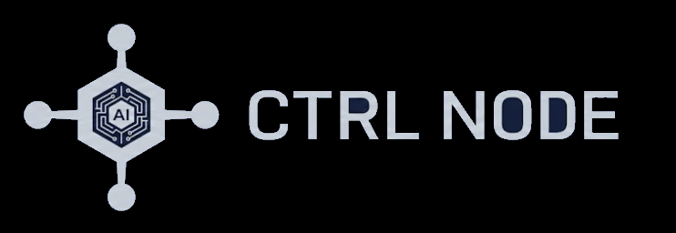

<div align="center">

<picture>
  <source media="(prefers-color-scheme: dark)" srcset="assets/logo-dark.png">
  <source media="(prefers-color-scheme: light)" srcset="assets/logo-light.png">
  
</picture>

### The control plane for teams running AI agents at scale.

[](LICENSE)
[](https://github.com/ctrlnode-ai/ctrlnode/releases)
[](https://ctrlnode.ai)
[](https://github.com/openclaw/openclaw)

[Website](https://ctrlnode.ai) · [Releases](https://github.com/ctrlnode-ai/ctrlnode/releases) · [Bridge setup](src/bridge/README.md) 

</div>

---

Your AI agents run on your machines. **CtrlNode gives your team the UI and coordination layer to manage them** — without moving your data to the cloud.

Assign tasks, orchestrate multi-step pipelines, watch agent output live. Your workspaces and task files **never leave your servers**.

---

## How it works

```
Your machine / VPS
  ├── OpenClaw runtime         (AI agent executor)
  └── Agent workspaces         (task files, outputs)
          │
          │  CtrlNode Bridge   ← the only thing you run  (open source)
          ▼
    CtrlNode SaaS              ← we host this
      ├── Task management UI
      ├── Pipeline orchestrator
      └── Team collaboration
```

Install the Bridge, pair it with your workspace, and your agents appear in the web UI within seconds. That's it.

---

## Get started in 3 steps

### 1 — Sign up

Create an account at [ctrlnode.ai](https://ctrlnode.ai). You'll get a **Pairing Token** from Settings → Bridge.

---

### 2 — Download the Bridge

| Platform | Binary |
|---|---|
| Linux (modern CPUs, AVX2) | `ctrlnode-bridge-linux-x64` |
| Linux (older CPUs, AVX only) | `ctrlnode-bridge-linux-x64-baseline` |
| macOS (Apple Silicon) | `ctrlnode-bridge-darwin-arm64` |
| Windows | `ctrlnode-bridge.exe` |

→ [Download from Releases](https://github.com/ctrlnode-ai/ctrlnode/releases)

Not sure which Linux binary? Run:
```bash
grep flags /proc/cpuinfo | head -1 | grep -o "avx[^ ]*"
```
`avx2` in the output → use the standard binary. Anything else → use `-baseline`.

---

### 3 — Run it

**Linux / macOS**
```bash
PAIRING_TOKEN=your_pairing_token \
OPENCLAW_GATEWAY_TOKEN=your_gateway_token \
./ctrlnode-bridge-linux-x64
```

**Windows (PowerShell)**
```powershell
$env:PAIRING_TOKEN = "your_pairing_token"
$env:OPENCLAW_GATEWAY_TOKEN = "your_gateway_token"
.\ctrlnode-bridge.exe
```

Open the CtrlNode web UI — your agents appear automatically. Create your first task and watch it run.

---

## Features

- **Task management** — create, assign, and track tasks across multiple agents
- **Pipeline orchestration** — multi-step workflows with agent dependencies and approvals
- **Real-time monitoring** — live file watching, session logs, agent status at a glance
- **Zero-Storage** — workspaces and task data never leave your servers; CtrlNode only sees what you explicitly stream

---

## What's in this repository

| Component | Path | Status |
|---|---|---|
| **Bridge** | [`src/bridge/`](src/bridge/) | ✅ Open source |
| **Web frontend** | — | 🔜 Coming soon |

The Bridge is the client-side connector. See [src/bridge/README.md](src/bridge/README.md) for full technical docs, all environment variables, and build instructions.

---

## Setup guides

- [doc/setup/native.md](doc/setup/native.md) — Linux/macOS native install with systemd
- [doc/setup/docker.md](doc/setup/docker.md) — Docker container install

---

## Contributing

PRs are welcome. For major changes, open an issue first.

```bash
git clone https://github.com/ctrlnode-ai/ctrlnode.git
cd ctrlnode
bun install
bun dev
```

---

## License

Licensed under the **[Elastic License 2.0](LICENSE)** (ELv2).

- ✅ Use freely on your own machines
- ✅ Modify and redistribute
- ❌ Cannot be offered as a managed/hosted service to third parties

---

<div align="center">

Built by [CtrlNode AI](https://ctrlnode.ai) · Works with [OpenClaw](https://github.com/openclaw/openclaw)

</div>
