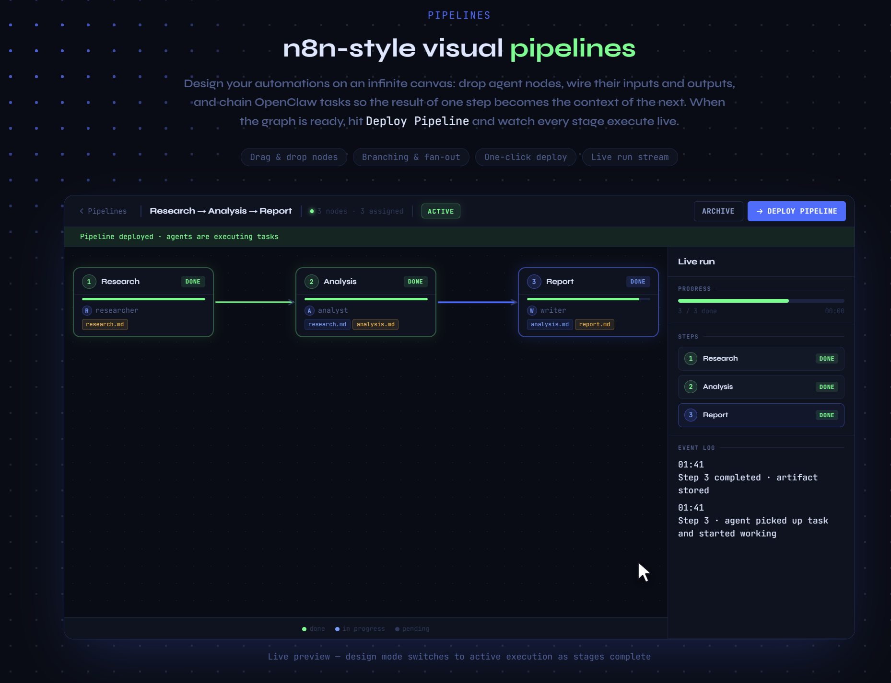
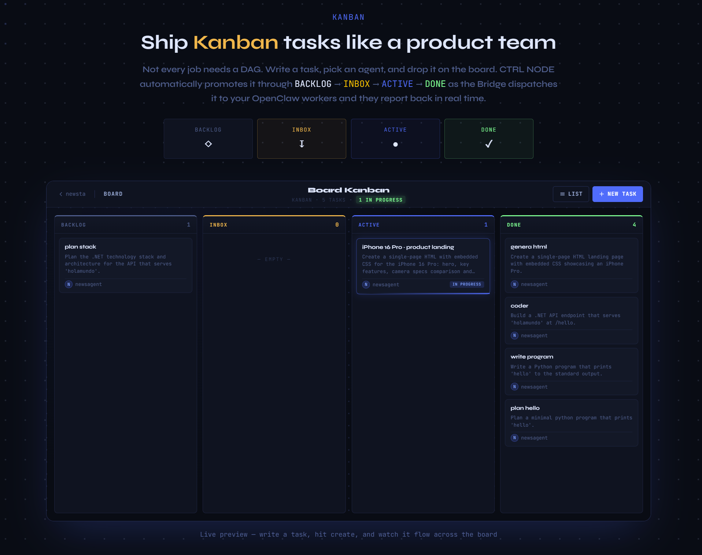

<div align="center">

<picture>
  <source media="(prefers-color-scheme: dark)" srcset="assets/logo-dark.png">
  <source media="(prefers-color-scheme: light)" srcset="assets/logo-light.png">
  
</picture>

### Visual orchestration for OpenClaw — pipelines and Kanban on your infrastructure.

[](LICENSE)
[](https://github.com/ctrlnode-ai/ctrlnode/releases)
[](https://ctrlnode.ai)
[](https://github.com/openclaw/openclaw)

[Website](https://ctrlnode.ai) · [Releases](https://github.com/ctrlnode-ai/ctrlnode/releases) · [Bridge setup](src/bridge/README.md)

</div>

---

**CTRL NODE** runs your OpenClaw fleet from one place: **pipelines or Kanban.** Ship work from **BACKLOG** to **DONE** — your data stays local with the Bridge; the Bridge and tooling are open source.

Launch AI tasks on OpenClaw as **pipelines** (n8n-style graphs) or on a **Kanban board**. Assign tasks, orchestrate multi-step flows, watch agent output live. Workspaces and task files **never leave your servers**.

---

## Pipelines — n8n-style visual pipelines

Design your automations on an infinite canvas: drop agent nodes, wire their inputs and outputs, and chain OpenClaw tasks so the result of one step becomes the context of the next. When the graph is ready, hit **Deploy Pipeline** and watch every stage execute live.

Drag & drop nodes · branching & fan-out · one-click deploy · live run stream.

Below: the **Pipelines** section from the public site (`/#pipelines`) — same live preview as [ctrlnode.ai](https://ctrlnode.ai).



---

## Kanban — ship tasks like a product team

Not every job needs a DAG. Write a task, pick an agent, and drop it on the board. CTRL NODE promotes work through **BACKLOG → INBOX → ACTIVE → DONE** as the Bridge dispatches it to your OpenClaw workers and they report back in real time.

Below: the **Kanban** section from the public site (`/#kanban`).



---

## How it works

```
Your machine / VPS
  ├── OpenClaw runtime         (AI agent executor)
  └── Agent workspaces         (task files, outputs)
          │
          │  CTRL NODE Bridge   ← lightweight client you run (open source)
          ▼
    CTRL NODE control plane    ← hosted UI & coordination
      ├── Task management UI
      ├── Pipeline orchestrator
      └── Team collaboration
```

Install the Bridge, pair it with your workspace, and your agents appear in the web UI within seconds.

---

## Prerequisites — OpenClaw gateway config

The Bridge communicates with OpenClaw via its local gateway. Before running the Bridge, make sure your OpenClaw config includes the required bindings and tool permissions:

```bash
grep -A10 '"gateway"' ~/.openclaw/openclaw.json
```

The `gateway` block must look like this:

```json
"gateway": {
  "bind": "lan",
  "tools": {
    "allow": ["sessions_spawn", "sessions_send", "sessions_list"]
  }
}
```

If the block is missing or incomplete, edit `~/.openclaw/openclaw.json` and add it, then restart the OpenClaw gateway.

---

## Get started in 3 steps

### 1 — Sign up

Create an account at [ctrlnode.ai](https://ctrlnode.ai). You'll get a **Pairing Token** from **Settings → Bridge**.

---

### 2 — Install & pair

Run the one-liner for your platform. The installer downloads the right binary, adds it to PATH, then **asks for your two tokens** and prints the exact command to run.

**Linux / macOS**
```bash
curl -fsSL https://github.com/ctrlnode-ai/ctrlnode/releases/download/v2026.1.1/install.sh | sh
```

**Windows (PowerShell)**
```powershell
irm https://github.com/ctrlnode-ai/ctrlnode/releases/download/v2026.1.1/install.ps1 | iex
```

The installer will prompt for:
- **Pairing Token** — from [ctrlnode.ai](https://ctrlnode.ai) → Settings → Bridge
- **OpenClaw Gateway Token** — from `~/.openclaw/openclaw.json` → `gateway.auth.token`

At the end it prints the exact `ctrlnode-bridge` command with your tokens already filled in.

Example (Linux) — what the installer prints:

```bash
PAIRING_TOKEN="<your_pairing_token>" OPENCLAW_GATEWAY_TOKEN="<your_gateway_token>" ctrlnode-bridge
```

---

### 3 — Run it

Copy and run the command printed by the installer. Your agents appear in the CTRL NODE web UI within seconds — create your first task or pipeline and watch it run.

> Need more control? See [Advanced install →](doc/setup/advanced-install.md)

---

## Features

- **n8n-style pipelines** — visual graphs with agent nodes, deploy and live execution
- **Kanban workflow** — BACKLOG → INBOX → ACTIVE → DONE with OpenClaw dispatch
- **Team & dashboard** — operators, roles, activity and fleet overview in one place
- **Real-time monitoring** — live logs, agent status, pipeline progress
- **Zero-storage by design** — workspaces stay on your side of the Bridge; CTRL NODE only sees what you stream explicitly

---

## What's in this repository

| Component | Path | Status |
|---|---|---|
| **Bridge** | [`src/`](src/) | ✅ Open source |
| **Installer scripts** | [`install.ps1`](install.ps1) · [`install.sh`](install.sh) | ✅ Open source |
| **Releases** | [`Releases/`](Releases/) | Pre-built binaries per version |

The Bridge is the client-side connector that pairs your OpenClaw workers with the CTRL NODE control plane. See [doc/setup/advanced-install.md](doc/setup/advanced-install.md) for manual install, environment variables, and build instructions.

---

## Setup guides

- [doc/setup/advanced-install.md](doc/setup/advanced-install.md) — Manual install for all platforms + binary selection guide
- [doc/setup/docker.md](doc/setup/docker.md) — Bridge inside a Docker container alongside OpenClaw
- [doc/setup/linux.md](doc/setup/linux.md) — Linux server, no Docker (systemd service)
- [doc/setup/mac.md](doc/setup/mac.md) — macOS native (launchd service)

---

## Contributing

PRs are welcome. For major changes, open an issue first.

```bash
git clone https://github.com/ctrlnode-ai/ctrlnode.git
cd ctrlnode
bun install
bun dev
```

---

## License

Licensed under the **[Elastic License 2.0](LICENSE)** (ELv2).

- ✅ Use freely on your own machines
- ✅ Modify and redistribute
- ❌ Cannot be offered as a managed/hosted service to third parties

---

<div align="center">

Built by [CTRL NODE](https://ctrlnode.ai) · Works with [OpenClaw](https://github.com/openclaw/openclaw)

</div>
