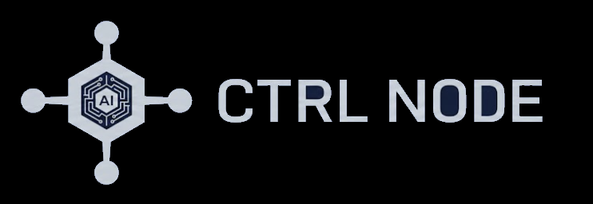
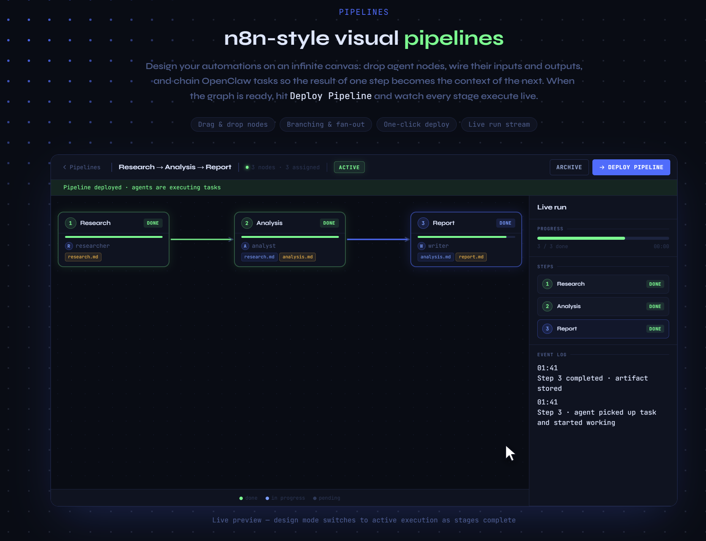
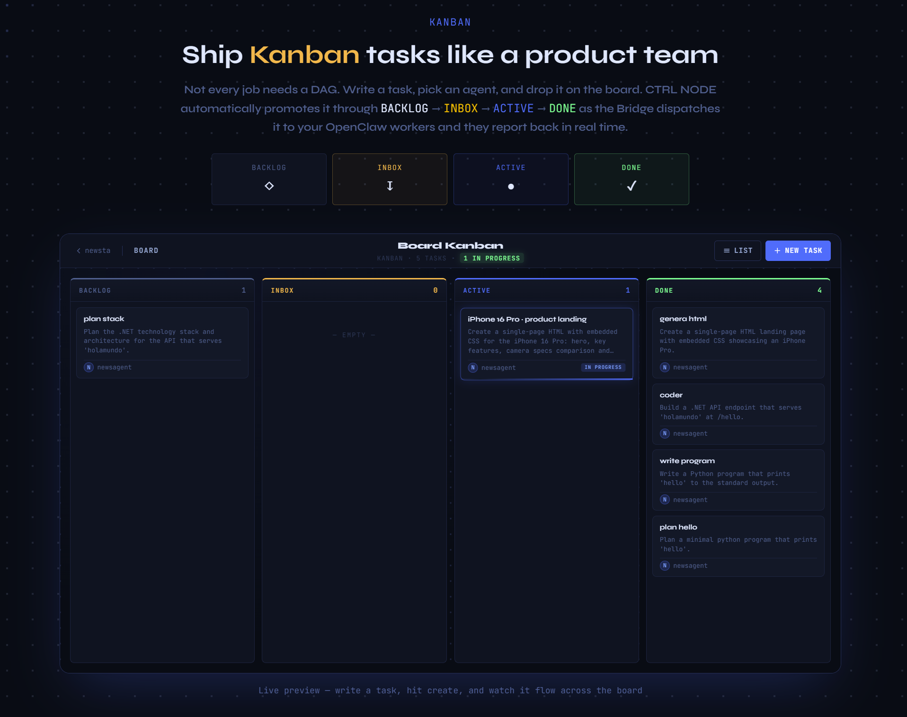

<div align="center">

<picture>
  <source media="(prefers-color-scheme: dark)" srcset="assets/logo-dark.png">
  <source media="(prefers-color-scheme: light)" srcset="assets/logo-light.png">
  
</picture>

### Launch tasks on Claude, Copilot, Gemini, Codex, Cursor or OpenClaw — remotely, from anywhere.

[](LICENSE)
[](https://github.com/ctrlnode-ai/ctrlnode/releases)
[](https://ctrlnode.ai)

[Website](https://ctrlnode.ai) · [Releases](https://github.com/ctrlnode-ai/ctrlnode/releases) · [Bridge setup](src/bridge/README.md)

</div>

---

**CTRL NODE** lets you **launch tasks on AI coding agents running on your own machine or VPS — from anywhere, through a web UI**.

Write a task. Pick an agent. Hit run. The task lands on your machine — Claude edits your files, Copilot writes code, Gemini runs scripts — while you watch the output stream live from your browser, no matter where you are in the world.

Install the tiny Bridge binary on the machine where your agents live. It opens one outbound connection to CTRL NODE — no port-forwarding, no VPN, no firewall rules. Then from [app.ctrlnode.ai](https://app.ctrlnode.ai) you can launch tasks, chain them into pipelines, and track every run remotely.

Supports **Claude, Copilot, Gemini, Codex, Cursor, OpenClaw**, or any combination. Your files and workspaces **never leave your machine** — CTRL NODE only sees the output you stream.

---

## Supported providers

The Bridge connects to any of the following agent backends — called **providers** — in the same process:

| Provider | Description | Guide |
|---|---|---|
| **Claude** (`claude-sdk`) | Anthropic Claude via `@anthropic-ai/claude-agent-sdk` or the `claude` CLI | [doc/claude-sdk.md](doc/claude-sdk.md) |
| **Copilot** (`copilot`) | GitHub Copilot via the ACP protocol | [doc/copilot.md](doc/copilot.md) |
| **Gemini** (`gemini`) | Google Gemini CLI via the ACP protocol | [doc/gemini.md](doc/gemini.md) |
| **Codex** (`codex`) | OpenAI Codex via `@openai/codex-sdk` | [doc/codex.md](doc/codex.md) |
| **Cursor** (`cursor`) | Cursor via `@cursor/sdk` | [doc/cursor.md](doc/cursor.md) |
| **OpenClaw** (`openclaw`) | OpenClaw agent runtime (HTTP gateway) | [doc/openclaw.md](doc/openclaw.md) |

You can run multiple providers in parallel from one Bridge process by listing them in `PROVIDERS`:

```env
PROVIDERS=claude-sdk,copilot,cursor
```

---

## How it works

```
  You — anywhere on the internet
  (browser, laptop, phone)
          │
          │  https://app.ctrlnode.ai
          ▼
    CTRL NODE control plane    ← hosted UI & orchestration
      ├── Task management UI
      ├── Pipeline orchestrator
      └── Team collaboration
          │
          │  WebSocket (outbound from Bridge — no open ports needed)
          ▼
    Your machine / VPS
      ├── CTRL NODE Bridge   ← lightweight client you run (open source)
      ├── Claude / Copilot / Gemini / Codex / Cursor / OpenClaw
      └── Agent workspaces (task files, outputs — stay local)
```

The Bridge makes a single **outbound** WebSocket connection to CTRL NODE.  No inbound ports, no VPN, no firewall changes — it works behind NAT, inside Docker, on a headless VPS.  From the web UI you can dispatch tasks, design pipelines, and read live agent output as if you were sitting in front of the machine.

---

## Pipelines — chain tasks across agents

Need more than one task? Design a pipeline: drop agent nodes on an infinite canvas, wire the output of one task into the input of the next, and deploy the whole graph in one click. Each node runs a task on whichever agent you choose — Claude for one step, Codex for the next — all triggered remotely from your browser.

Drag & drop nodes · branching & fan-out · cross-provider chains · live task stream per node.



---

## Kanban — launch tasks without a pipeline

Not every job needs a DAG. Write a task description, assign an agent, and drop it on the board. CTRL NODE sends it to your machine remotely and promotes the card through **BACKLOG → INBOX → ACTIVE → DONE** as the agent works and reports back in real time.



---

## Get started in 3 steps

### 1 — Sign up

Create an account at [ctrlnode.ai](https://ctrlnode.ai). You'll get a **Pairing Token** from Settings → Bridge.

---

### 2 — Install the Bridge

**Linux / macOS** — one-liner installer (detects platform and CPU automatically):

```bash
curl -fsSL https://raw.githubusercontent.com/ctrlnode-ai/ctrlnode/main/install.sh | sh
```

**Windows (PowerShell)**:

```powershell
irm https://raw.githubusercontent.com/ctrlnode-ai/ctrlnode/main/install.ps1 | iex
```

This downloads the right binary for your platform and installs it to `/usr/local/bin/` (Linux/macOS) or `%LOCALAPPDATA%\Programs\ctrlnode` (Windows, added to PATH automatically).

<details>
<summary>Manual download (no curl)</summary>

| Platform | Binary |
|---|---|
| Linux (modern CPUs, AVX2) | `ctrlnode-bridge-linux-x64` |
| Linux (older CPUs, AVX only) | `ctrlnode-bridge-linux-x64-baseline` |
| macOS (Apple Silicon) | `ctrlnode-bridge-darwin-arm64` |
| Windows | `ctrlnode-bridge.exe` |

→ [Download from Releases](https://github.com/ctrlnode-ai/ctrlnode/releases)

Not sure which Linux binary? `grep flags /proc/cpuinfo | head -1 | grep -o "avx[^ ]*"` — `avx2` → standard, anything else → `-baseline`.

</details>

---

### 3 — Run it

Just run the binary — it guides you through setup on first launch:

```
$ ./ctrlnode-bridge

Enter your CtrlNode pairing token (app.ctrlnode.ai → Bridge Tokens): xxxxxxxxxx

Select providers to enable (Y = yes, Enter = no):
  [ ] Enable OpenClaw?         [y/N]:
  [ ] Enable Claude?           [y/N]:
  [ ] Enable GitHub Copilot?   [y/N]:
  [ ] Enable Gemini?           [y/N]:
  [ ] Enable Codex?            [y/N]:
  [ ] Enable Cursor?           [y/N]:
```

Answer `y` for each provider you want to use — the Bridge will ask for the required credentials (API key, token, or binary path) right there in the terminal, save them to a local `.env` file, and connect. On subsequent runs it reads the saved config automatically.

You can also skip the wizard and pass everything as environment variables or in a `.env` file next to the binary (see the [per-provider guides](doc/providers/) for the exact variable names).

Open the CTRL NODE web UI — your agents appear automatically. Write a task, assign it, and watch it run live from your browser.

See the per-provider guides in [`doc/`](doc/) for full setup instructions.

---

## Features

- **Remote task launch** — write a task in the web UI, run it on your machine from anywhere; no SSH, no VPN, no open ports
- **Live task output** — watch the agent work in real time, line by line, straight from your browser
- **Outbound-only Bridge** — one lightweight binary on your machine opens a single outbound connection; NAT, Docker, and headless VPS all work with zero network configuration
- **Multi-provider** — Claude, Copilot, Gemini, Codex, Cursor, OpenClaw all from one Bridge process
- **n8n-style pipelines** — visual graphs with agent nodes, cross-provider chains, deploy and live execution
- **Kanban workflow** — BACKLOG → INBOX → ACTIVE → DONE with real-time agent feedback
- **Team & dashboard** — operators, roles, activity and fleet overview in one place
- **Zero-storage by design** — workspaces stay on your side of the Bridge; CTRL NODE only sees what you stream explicitly

---

## What's in this repository

| Component | Path |
|---|---|
| **Bridge** (open source) | [`src/`](src/) |
| **Provider guides** | [`doc/`](doc/) |
| **Release notes** | [`Releases/`](Releases/) |

The Bridge source is in [`src/`](src/). See the [per-provider guides](doc/providers/) for environment variables and the [setup guides](doc/setup/) for deployment option

## Provider guides

- [doc/claude-sdk.md](doc/claude-sdk.md) — Anthropic Claude (SDK + CLI)
- [doc/copilot.md](doc/copilot.md) — GitHub Copilot (ACP)
- [doc/gemini.md](doc/gemini.md) — Google Gemini CLI (ACP)
- [doc/codex.md](doc/codex.md) — OpenAI Codex SDK
- [doc/cursor.md](doc/cursor.md) — Cursor SDK
- [doc/openclaw.md](doc/openclaw.md) — OpenClaw runtime

---

## Contributing

PRs are welcome. For major changes, open an issue first.

```bash
git clone https://github.com/ctrlnode-ai/ctrlnode.git
cd ctrlnode
bun install
bun dev
```

---

## License

Licensed under the **[Elastic License 2.0](LICENSE)** (ELv2).

- ✅ Use freely on your own machines
- ✅ Modify and redistribute
- ❌ Cannot be offered as a managed/hosted service to third parties

---

<div align="center">

Built by [CTRL NODE](https://ctrlnode.ai)

</div>
