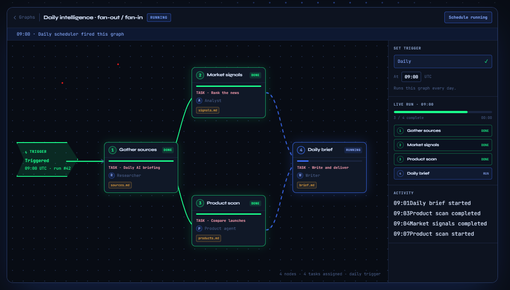

<div align="center">

<picture>
  <source media="(prefers-color-scheme: dark)" srcset="assets/logo-dark.png">
  <source media="(prefers-color-scheme: light)" srcset="assets/logo-light.png">
  
</picture>

### Control and run AI agent graphs from anywhere.

[](LICENSE)
[](https://github.com/ctrlnode-ai/ctrlnode/releases)
[](https://ctrlnode.ai)

[Website](https://ctrlnode.ai) · [App](https://app.ctrlnode.ai) · [Releases](https://github.com/ctrlnode-ai/ctrlnode/releases)

</div>

---

**CTRL NODE is a control system for AI agent graphs.** Build a graph from agent, task, and control nodes; connect the paths they can take; then run and observe it from one place.

Install the open-source Bridge on your laptop, server, or CI machine. It makes one outbound connection to CtrlNode, so your agents and workspaces stay on your machine—no inbound ports, VPN, or firewall changes.

---

## What changed in v2026.3.1

- **Git workspace support** — inspect repository status and diffs, and request guarded Git operations from the Bridge.
- **Provider capabilities** — discover provider skills and capability catalogues in the task workflow.
- **Friendlier terminal experience** — a startup welcome panel shows your workspace, config, provider, and version, with keyboard navigation for the trust prompt.  
 
See the full [v2026.3.1 release notes](Releases/v2026.3.1/Release-notes-v2026.3.1.md).

---

## How it works

```text
  CtrlNode app
       │
       │  Build and run AI agent graphs
       ▼
  CtrlNode control plane
       ├── Tasks and Kanban
       ├── Routines
       ├── Graph canvas
       └── Team, files, and activity
       │
       │  Outbound WebSocket
       ▼
  Your machine or server
       ├── CtrlNode Bridge
       ├── Your AI providers
       └── Your local workspaces and files
```

The Bridge only connects out. Your code and workspaces never leave your machine unless an agent explicitly returns output to CtrlNode.

---

## Supported providers

| Provider | Runs through | Setup |
|---|---|---|
| `claude` | Claude Agent SDK / Claude Code | `ANTHROPIC_API_KEY` or subscription |
| `copilot` | GitHub Copilot ACP | Copilot extension |
| `gemini` | Gemini CLI ACP | `GEMINI_API_KEY` |
| `codex` | OpenAI Codex SDK | `CODEX_API_KEY` |
| `cursor` | Cursor SDK | `CURSOR_API_KEY` |
| `hermes` | Hermes ACP | Hermes CLI |
| `openclaw` | OpenClaw gateway | `OPENCLAW_GATEWAY_TOKEN` |
| `openrouter` | OpenRouter API | `OPENROUTER_API_KEY` |
| `ollama` | Local Ollama | Install Ollama and pull a model |

Use more than one provider in the same graph.

---

## Ai Agents Graphs



A **Graph** is the visual execution model in CtrlNode. Add agent nodes, connect their paths, choose a trigger, and deploy. Each node can use the provider and model that fits its job.

- Branch and fan out work
- Mix providers in one graph
- Start from a schedule or event
- Follow every node's activity live

---

## Kanban — ship tasks like a product team


Write a task, assign an agent, and drop it on the board. CTRL NODE automatically moves it through **BACKLOG → INBOX → ACTIVE → DONE** as the Bridge dispatches it to your agents and they report back in real time.

---

## Also included

- **Routines** — schedule recurring agent work.
- **Live activity** — watch output as each agent runs.
- **Files and memory** — give agents the local context they need.

---

## Get started

### 1. Install the Bridge

**Linux / macOS**

```bash
curl -fsSL https://github.com/ctrlnode-ai/ctrlnode/releases/latest/download/install.sh | bash
```

**Windows PowerShell**

```powershell
irm https://github.com/ctrlnode-ai/ctrlnode/releases/latest/download/install.ps1 | iex
```

Or [download a binary from Releases](https://github.com/ctrlnode-ai/ctrlnode/releases).

### 2. Sign in

```bash
ctrlnode login
```

Approve the code in your browser. Bridge stores the pairing token in its `.env` file.

### 3. Start the Bridge

```bash
ctrlnode
```

Your agents appear in the app. Create a task or graph and run it on your machine.

---

## Repository

| Component | Path |
|---|---|
| **Bridge source** | [`src/`](src/) |
| **Provider guides** | [`doc/`](doc/) |
| **Release notes** | [`Releases/`](Releases/) |

## Contributing

```bash
git clone https://github.com/ctrlnode-ai/ctrlnode.git
cd ctrlnode
bun install
bun dev
```

## License

Licensed under the [Elastic License 2.0](LICENSE) (ELv2).

<div align="center">

Built by [CTRL NODE](https://ctrlnode.ai)

</div>
