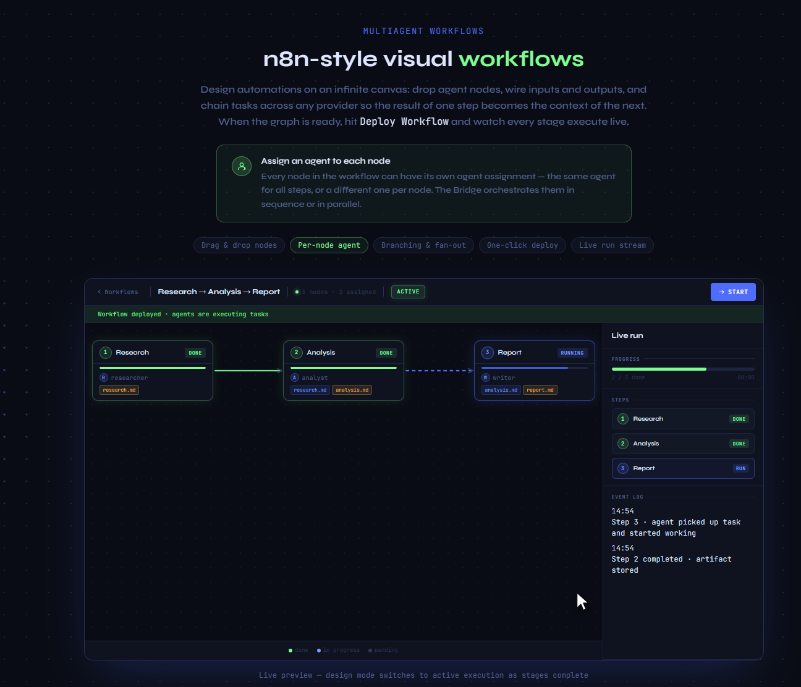
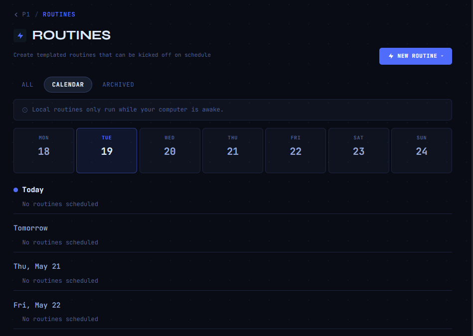

<div align="center">

<picture>
  <source media="(prefers-color-scheme: dark)" srcset="assets/logo-dark.png">
  <source media="(prefers-color-scheme: light)" srcset="assets/logo-light.png">
  
</picture>

### Orchestrate AI coding agents — tasks, routines, and workflows — from anywhere.

[](LICENSE)
[](https://github.com/ctrlnode-ai/ctrlnode/releases)
[](https://ctrlnode.ai)

[Website](https://ctrlnode.ai) · [Releases](https://github.com/ctrlnode-ai/ctrlnode/releases) · [Bridge setup](src/bridge/README.md)

</div>

---

**CTRL NODE** is a remote orchestration platform for AI coding agents. Install the Bridge binary on any machine — your laptop, a dev VPS, a CI box — and from [app.ctrlnode.ai](https://app.ctrlnode.ai) you can dispatch tasks, schedule recurring routines, and design multi-step workflows that trigger automatically, all without opening a single inbound port.

Works with **Claude, Copilot, Gemini, Codex, Cursor, OpenClaw**, or any combination. Your code and workspaces **never leave your machine** — CTRL NODE only sees the output you explicitly stream back.

---

## What's new in v2.1

- **Routines** — schedule recurring tasks on a cron-style cadence; agents run automatically and report back through the same live stream
- **Multi-agent Workflows** — build multi-step agent workflows that start on a schedule, a webhook, or when another workflow completes
- **Model selection** — choose the exact AI model per agent (claude-sonnet-4-6, gpt-5.5, gemini-3.1-pro, …); the Bridge reports available models on connect and the UI surfaces them as a searchable drop-down

---

## How it works

```
  You — anywhere on the internet
  (browser, laptop, phone)
          │
          │  https://app.ctrlnode.ai
          ▼
    CTRL NODE control plane    ← hosted UI & orchestration
      ├── Task & Kanban board
      ├── Routines scheduler
      ├── Workflow designer (trigger → steps → done)
      └── Team, memory & activity dashboard
          │
          │  WebSocket (outbound from Bridge — no open ports needed)
          ▼
    Your machine / VPS
      ├── CTRL NODE Bridge   ← lightweight binary you run (open source)
      ├── Claude / Copilot / Gemini / Codex / Cursor / OpenClaw
      └── Agent workspaces (files and outputs — stay local)
```

The Bridge makes a single **outbound** WebSocket connection.  No inbound ports, no VPN, no firewall rules — it works behind NAT, inside Docker, on a headless server.

---

## Supported providers

| Provider | Backend | Key env var |
|---|---|---|
| `claude` / `claude-sdk` | Anthropic `@anthropic-ai/claude-agent-sdk` | `ANTHROPIC_API_KEY` |
| `copilot` | GitHub Copilot (ACP protocol) | *(Copilot extension)* |
| `gemini` | Google Gemini CLI (ACP protocol) | `GEMINI_API_KEY` |
| `codex` | OpenAI `@openai/codex-sdk` | `CODEX_API_KEY` |
| `cursor` | Cursor `@cursor/sdk` | `CURSOR_API_KEY` |
| `openclaw` | OpenClaw HTTP gateway | `OPENCLAW_GATEWAY_TOKEN` |

Run multiple providers from one Bridge process:

```env
PROVIDERS=claude-sdk,copilot,cursor
```

---

## Features

- **Remote task launch** — write a task in the web UI, run it on your machine from anywhere; no SSH, no VPN, no open ports
- **Routines** — schedule recurring agent tasks (cron-style); runs are tracked and streamed like any manual task
- **Multi-agent Workflows** — visual workflow designer; wire steps together, set a time or event trigger, deploy in one click
- **Live output stream** — watch the agent work line by line from your browser in real time
- **Outbound-only Bridge** — single lightweight binary, one outbound WebSocket; NAT, Docker, and headless VPS all work out of the box
- **Multi-provider** — Claude, Copilot, Gemini, Codex, Cursor, OpenClaw from one Bridge process; mix providers across steps
- **Model selection** — pick the exact model per agent; Bridge reports available models on connect
- **Kanban workflow** — BACKLOG → INBOX → ACTIVE → DONE with real-time agent feedback
- **Team & dashboard** — operators, roles, live activity and fleet overview
- **Memory** — persistent knowledge attached to each project, accessible to agents
- **Zero-storage by design** — workspaces stay on your side; CTRL NODE only sees what you stream explicitly

---

## Get started in 3 steps

### 1 — Sign up

Create an account at [ctrlnode.ai](https://ctrlnode.ai). You'll get a **Pairing Token** from Settings → Bridge.

---

### 2 — Install the Bridge

**Linux / macOS** — one-liner (detects platform and CPU automatically):

```bash
curl -fsSL https://raw.githubusercontent.com/ctrlnode-ai/ctrlnode/main/install.sh | sh
```

**Windows (PowerShell)**:

```powershell
irm https://raw.githubusercontent.com/ctrlnode-ai/ctrlnode/main/install.ps1 | iex
```

Installs to `/usr/local/bin/` (Linux/macOS) or `%LOCALAPPDATA%\Programs\ctrlnode` (Windows, added to PATH).

<details>
<summary>Manual download</summary>

| Platform | Binary |
|---|---|
| Linux x64 (modern CPUs, AVX2) | `ctrlnode-bridge-linux-x64` |
| Linux x64 (older CPUs / cloud VMs) | `ctrlnode-bridge-linux-x64-baseline` |
| macOS Apple Silicon | `ctrlnode-bridge-darwin-arm64` |
| Windows x64 | `ctrlnode-bridge.exe` |

→ [Download from Releases](https://github.com/ctrlnode-ai/ctrlnode/releases)

Not sure which Linux binary? Run `grep -o "avx[^ ]*" /proc/cpuinfo | head -1` — `avx2` → standard, anything else → `-baseline`.

</details>

---

### 3 — Run it

```
$ ./ctrlnode-bridge

Enter your CtrlNode pairing token (app.ctrlnode.ai → Bridge Tokens): xxxxxxxxxx

Select providers to enable (Y = yes, Enter = no):
  [ ] Enable OpenClaw?         [y/N]:
  [ ] Enable Claude?           [y/N]:
  [ ] Enable GitHub Copilot?   [y/N]:
  [ ] Enable Gemini?           [y/N]:
  [ ] Enable Codex?            [y/N]:
  [ ] Enable Cursor?           [y/N]:
```

The setup wizard asks for credentials once, saves them to a local `.env` file, and connects. On subsequent runs it reads the saved config automatically. You can also skip the wizard by setting environment variables directly — see the [per-provider guides](doc/) for the exact variable names.

Your agents appear in the web UI automatically. Create a task, assign it, and watch it run live from your browser.

---

## Multi-agent Workflows — visual automation



Design a workflow in the drag-and-drop canvas: drop agent nodes, wire the output of one step into the input of the next, set a **trigger** (schedule or event), and deploy. Each step runs on whichever agent and provider you choose — Claude for one step, Codex for the next.

- Branching and fan-out
- Cross-provider chains
- Time triggers and event triggers
- Live output stream per step

---

## Kanban — ship tasks like a product team


Write a task, assign an agent, and drop it on the board. CTRL NODE automatically moves it through **BACKLOG → INBOX → ACTIVE → DONE** as the Bridge dispatches it to your agents and they report back in real time.

---

## Routines — recurring scheduled tasks



Create a Routine to run a task on a repeating schedule (daily summary, nightly refactor, weekly report…). The agent receives the task exactly as if you sent it manually — same live stream, same output artifacts, same status tracking.

---

## What's in this repository

| Component | Path |
|---|---|
| **Bridge source** (open source) | [`src/`](src/) |
| **Provider guides** | [`doc/`](doc/) |
| **Release notes** | [`Releases/`](Releases/) |

---

## Provider guides

- [doc/claude-sdk.md](doc/claude-sdk.md) — Anthropic Claude (SDK + CLI)
- [doc/copilot.md](doc/copilot.md) — GitHub Copilot (ACP)
- [doc/gemini.md](doc/gemini.md) — Google Gemini CLI (ACP)
- [doc/codex.md](doc/codex.md) — OpenAI Codex SDK
- [doc/cursor.md](doc/cursor.md) — Cursor SDK
- [doc/openclaw.md](doc/openclaw.md) — OpenClaw runtime

---

## Contributing

PRs are welcome. For major changes, open an issue first.

```bash
git clone https://github.com/ctrlnode-ai/ctrlnode.git
cd ctrlnode
bun install
bun dev
```

---

## License

Licensed under the **[Elastic License 2.0](LICENSE)** (ELv2).

- ✅ Use freely on your own machines
- ✅ Modify and redistribute
- ❌ Cannot be offered as a managed/hosted service to third parties

---

<div align="center">

Built by [CTRL NODE](https://ctrlnode.ai)

</div>
